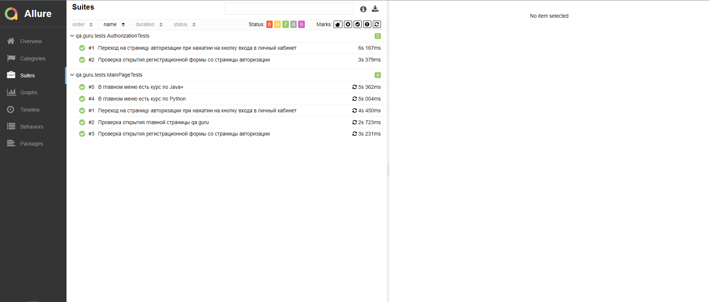

# Проект по автоматизации тестирования UI сайта qa.guru

### Технологии и инструменты:
<p align="center">


</p>

### Реализованные проверки:
* Проверка открытия главной страницы qa.guru
* Переход на страницу авторизации при нажатии на кнопку входа в личный кабинет
* Проверка открытия регистрационной формы со страницы авторизации
* Проверка, что в главном меню есть курс по Java+
* Проверка, что в главном меню есть курс по Python
* Проверка отсутствия ошибок в логах консоли

### Запуск тестов из терминала
#### Локальный запуск тестов:
```bash
gradle clean test
```

#### Удаленный запуск тестов с параметрами:

```bash
gradle clean test
-Dbrowser=${BROWSER}
-DbrowserSize=${BROWSER_SIZE}
-DbrowserVersion=${BROWSER_VERSION}
-DbaseUrl=${BASE_URL}
-Dselenoid=${SELENOID}
```
где: 

- <code>BROWSER</code> – браузер, в котором будут выполняться тесты;
- <code>BROWSER_SIZE</code> – размер окна браузера, в котором будут выполняться тесты;
- <code>BROWSER_VERSION</code> – версия браузера, в которой будут выполняться тесты;
- <code>BASE_URL</code> – адрес сайта;
- <code>SELENOID</code> - Логин, пароль и адрес удаленного сервера Selenoid на котором будут запускаться тесты.

### Сборка в [Jenkins](https://jenkins.autotests.cloud/job/rezchikov_qa.guru_tests)
<p align="center">

</p>

### Отчет в [Allure report](https://jenkins.autotests.cloud/job/rezchikov_qa.guru_tests/7/allure/)
#### Основная страница отчета
<p align="center">

</p>

#### Тест-кейсы
<p align="center">

</p>

### Уведомления в Telegram с использованием бота
<p align="center">

</p>

### Пример видео выполнения теста на Selenoid
<p align="center">
  
</p>
